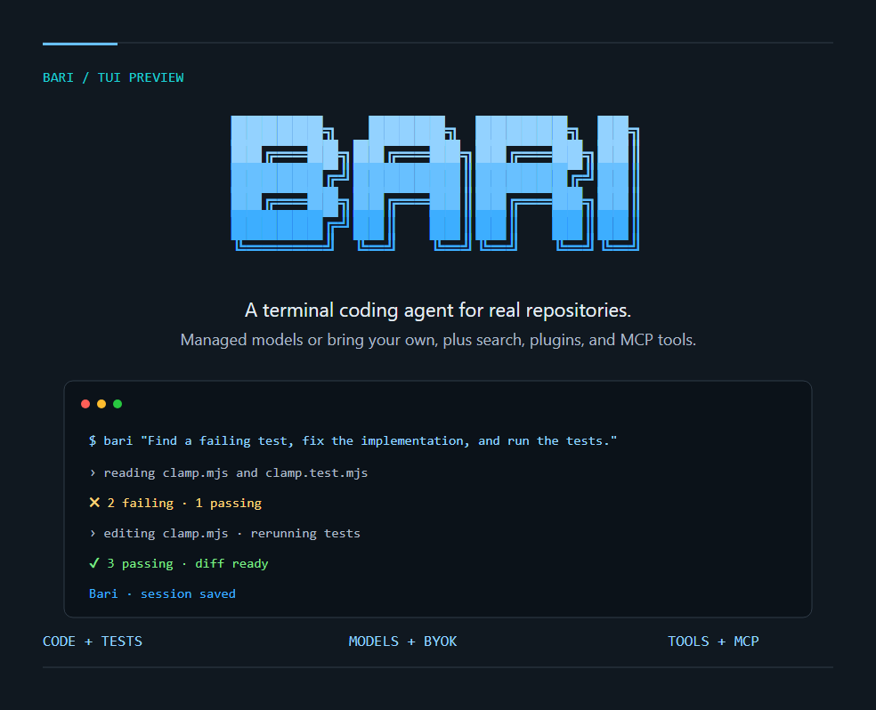

<p align="center">
  <picture>
    <source media="(prefers-color-scheme: dark)" srcset="docs/assets/wordmark-dark.svg">
    <source media="(prefers-color-scheme: light)" srcset="docs/assets/wordmark-light.svg">
    
  </picture>
</p>

<h1 align="center">Bari</h1>
<p align="center">A terminal coding agent with MiniMax, your own models, and tools beyond code.</p>
<p align="center">
  <a href="#quick-start">Get started</a> ·
  <a href="docs/README.md">Documentation</a> ·
  <a href="docs/examples.md">Examples</a> ·
  <a href="CONTRIBUTING.md">Contributing</a>
</p>
<p align="center"><strong>English</strong> · <a href="README_ZH.md">简体中文</a></p>
<p align="center">
  
  
  <a href="LICENSE-STATUS.md"></a>
</p>

Understand a project, make changes, and run tests from your terminal. Use your MiniMax account or bring your own model, with search, plugins, and multimodal tools in the same workflow.

[](docs/demo.md)

<p align="center"><a href="docs/demo.md">See the preview and try the example →</a> · Illustrated terminal view</p>

## Quick start

### 1. Build Bari from source

Bari is distributed as source for now. You need Git, **Node.js 22.19+ (22.x), 24.2+ (24.x), 25, or 26**, and **pnpm 9.12.0**:

```bash
git clone https://github.com/AkashaCorporation/Bari.git
cd Bari
pnpm install --frozen-lockfile
pnpm build
pnpm bari --version
pnpm bari --help
```

The first build requires an internet connection. Dependencies and the integrity-checked `mcode-tools` bundle come from public npm. See the [installation guide](docs/installation.md) for pnpm setup, system dependencies, and updates.

### 2. Sign in or bring your own API key

For a mainland China account:

```bash
bari login
```

For a Global account:

```bash
bari login --region global
```

Complete sign-in in your browser, then open `bari` and use `/status` to check your account and `/provider` to choose a model. Run `bari logout` to sign out.

Token Plan requires an account with available credits. User data is stored in `~/.bari` by default; an existing `~/.minimax-code` profile keeps being used until `~/.bari` exists. Set `BARI_DATA_DIR` to override. MiniMax account, model, and Token Plan documentation lives at [agent.minimax.io/docs](https://agent.minimax.io/docs/cli/quick-start).

<details>
<summary>Use your own API key (BYOK)</summary>

BYOK does not require a MiniMax login. Set `MCODE_PROVIDER_API_KEY` in your current shell, then add a provider. Replace the example URL and model name with your provider's values:

```bash
bari provider add --name my-provider --base-url https://example.com/v1 \
  --api-format openai-completions --model my-model \
  --api-key-env MCODE_PROVIDER_API_KEY --use
bari
```

Supported API formats: `openai-completions`, `openai-responses`, and `anthropic-messages`. See the [model examples](docs/examples.md#2-choose-your-own-model) for environment variable setup, connection checks, and model overrides for a single run.

</details>

### 3. Run your first task

Open the project you want to work on:

```bash
cd /path/to/your/project
bari
```

Describe your task in the TUI, or submit it directly when you launch Bari:

```bash
bari "Find a failing test, fix the implementation, and run the relevant tests."
```

Use `bari init .` to generate or update project guidance in `AGENTS.md`. Describe the expected result, allowed changes, and how to verify the task.

| Entry point | Command | Use it for |
| --- | --- | --- |
| Interactive TUI | `bari [prompt]` | Explore code, continue a conversation, and review changes or permissions. |
| Headless | `bari exec [prompt]` | Shell scripts, CI, batch work, and evaluations. |
| ACP | `bari acp` | Editors and clients supporting Agent Client Protocol. |

### Continue your work

```bash
# Resume the latest session in the current workspace
bari --continue

# Open the session picker
bari --session
```

Inside the TUI, use `/sessions` to find previous sessions and `/help` to see all commands and shortcuts.

| Action | Shortcut |
| --- | --- |
| Send a message or steer the running task | `Enter` |
| Queue a follow-up while a task is running | `Alt+Enter` |
| Insert a newline | `Shift+Enter` |
| Reference a workspace file or directory | `@` |
| Toggle Plan Mode | `Shift+Tab` |
| Switch permission modes | `Alt+M` |
| Close a panel or interrupt a running task | `Esc` |

## What you can do

| Task | Capabilities |
| --- | --- |
| **Edit and verify code** | Read files, inspect diffs, run shell commands and tests, and control tool execution with permissions and sandboxing. |
| **Choose your model** | Use a MiniMax account / Token Plan, or custom providers with OpenAI- or Anthropic-compatible API formats. |
| **Search and work with media** | Use built-in search, `mcode-tools` media tools, MCP, and managed connectors, subject to account access and service credits. |
| **Keep work moving** | Resume sessions, plan tasks, use subagents, and extend the agent with official, local, or GitHub plugins and built-in skills. |
| **Connect your workflow** | Run scripted tasks with the headless CLI, or connect compatible editors and clients through ACP. |

Account features, updates, feedback, and diagnostics are also included. Managed tools require network access and the relevant authorization. See [capabilities and service boundaries](docs/tui-capabilities.md) for details.

## Try it

Start the TUI in a copy of the example project and enter:

> Read clamp.mjs and clamp.test.mjs. Run node --test to reproduce the failure, fix clamp without changing the tests, then run the tests again.

The [small, reproducible project](examples/clamp) is the same task used in the demo above. [More examples](docs/examples.md) cover switching models, calling real search, and using your own image inputs.

## Build from source

To develop Bari or run this source checkout, you need Git, **Node.js 22.19+ (22.x), 24.2+ (24.x), 25, or 26**, and **pnpm 9.12.0**.

```bash
git clone https://github.com/AkashaCorporation/Bari.git
cd Bari
pnpm install --frozen-lockfile
pnpm build
pnpm bari
```

The first build requires an internet connection. Dependencies and the integrity-checked `mcode-tools` bundle come from public npm. See the [source installation guide](docs/installation.md) for pnpm setup, system dependencies, and updates.

From the source directory, use `pnpm bari` in place of `bari` in the examples above. To work on your own project, open its directory and launch the built CLI:

```bash
node /absolute/path/to/Bari/dist/cli.js
```

This repository targets the **0.4.12 upstream source baseline**. Installing the upstream published package and building this checkout are separate paths. Matching versions do not prove identical build provenance; see the [version and evidence baseline](docs/open-source-status.md#version-and-evidence-baseline).

## Documentation and contributing

- [Installation and updates](docs/installation.md) · [Examples](docs/examples.md) · [TUI status line](packages/tui/docs/status-line-config.md)
- [Contributor guide](CONTRIBUTING.md) · [Report a bug or propose an idea](https://github.com/AkashaCorporation/Bari/issues/new/choose) · [Report a security issue](SECURITY.md)
- [All documentation](docs/README.md): architecture, capability coverage, verification records, source synchronization, and release preparation.

English is the primary documentation language. The [Chinese README](README_ZH.md) mirrors this page.

For now, code and documentation pull requests are accepted only from repository collaborators. If you are not a collaborator but have an idea or proposal, please [open an issue](https://github.com/AkashaCorporation/Bari/issues/new/choose) so we can discuss it. Remove secrets, account details, and private project content from reports.

## Support

This repository hosts issue reporting for Bari. The published source covers the terminal TUI, headless CLI, and ACP. For a CLI bug, include `bari --version`, your interface, and a minimal reproduction. Remove credentials and private project content from reports. [Report a problem or ask a question](https://github.com/AkashaCorporation/Bari/issues/new/choose).

## License

First-party code defaults to [MIT](LICENSE). Existing file-level and package-level licenses remain in place. See [third-party notices](THIRD_PARTY_NOTICES.md) and [license status](LICENSE-STATUS.md) for dependencies, assets, and `mcode-tools`.
