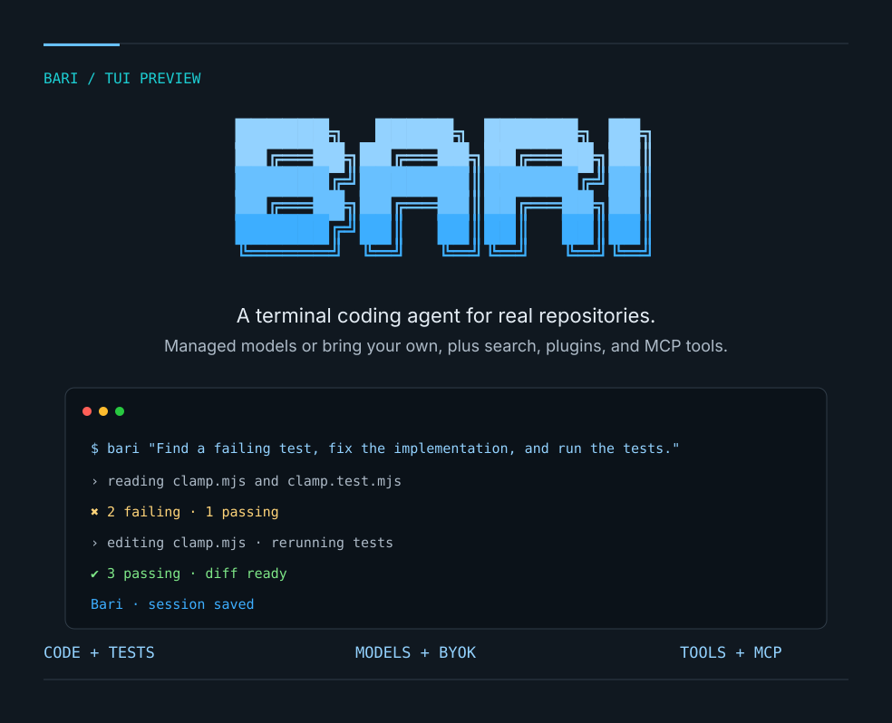

# A coding task



[View the full-size PNG](assets/tui-demo.png) · [Example source](../examples/clamp)

## What the preview shows

The card illustrates the interactive TUI on the small [clamp example](../examples/clamp). The task is:

> Read clamp.mjs and clamp.test.mjs. Run node --test to reproduce the failure, fix clamp without changing the tests, then run the tests again. Reply briefly in English.

The example ships with a failing assertion: two tests fail and one passes. Ask Bari to fix the implementation without touching the tests, and it reads the files, runs `node --test`, edits `clamp.mjs`, and reruns the suite until all three tests pass. Full access is only appropriate for this isolated synthetic project; use `/permission` to choose a mode for your own work.

## Try it locally

```bash
cd examples/clamp
node --test          # reproduce the failures
cd ../..
pnpm bari            # launch the TUI, then paste the prompt above
```

The previous animated replay came from the upstream 0.3.11 build and was removed together with the upstream branding. The current card is an illustration, not a recorded session; regenerate a real capture with the workflow of your choice when needed.

## Assets

- The README's light and dark wordmarks use the TUI welcome logo with the terminal theme colors.
- `assets/tui-demo.svg` and `assets/social-preview.svg` are the editable sources; the committed PNGs are rendered from them with a headless browser (or any SVG rasterizer) when the sources change.
- `assets/social-preview.png` is a 1280 × 640 sharing card for maintainers to configure as the GitHub Social Preview at release time.

This demonstrates one small code repair, not acceptance of every project, provider, or tool. See the [verification records](verification.md) for broader evidence.
